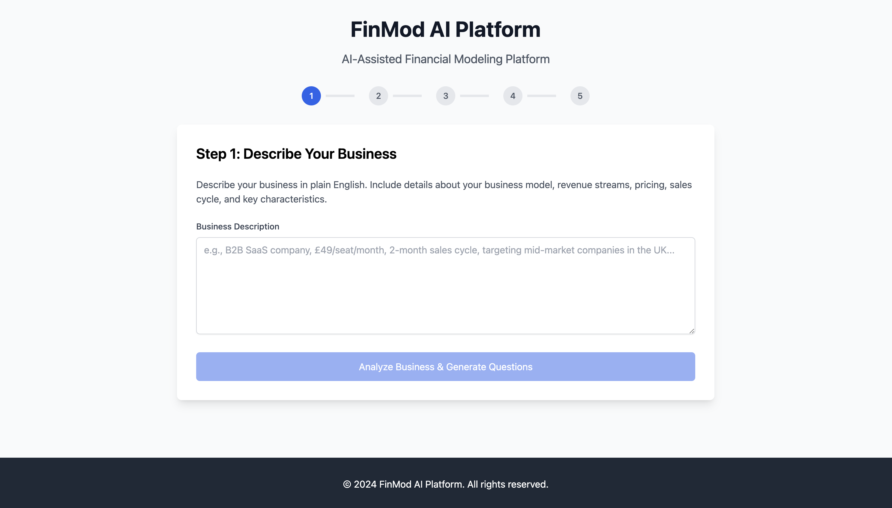

# FinMod AI Platform

An AI-assisted financial modeling platform that generates comprehensive 3-statement financial models from business descriptions in plain English.



## 🚀 Features

- **AI-Powered Business Classification**: Automatically identifies business models (SaaS, eCommerce, Marketplace, etc.)
- **Adaptive Question Engine**: Generates relevant follow-up questions based on business type and context
- **Deterministic Modeling Engine**: Creates accurate 3-statement financial models with schedules and scenarios
- **Template System**: YAML/JSON DSL for defining business model templates
- **Excel Export**: Generates auditable Excel files with named ranges, cross-sheet formulas, and audit sheets
- **CSV Export**: Exports individual sheets as CSV files for external analysis
- **Audit & Validation**: Built-in checks for model integrity and reasonableness

## 🏗️ Architecture

### Core Components

1. **Business Classifier (LLM)**
   - Analyzes business descriptions
   - Extracts structured intents (currency, time granularity, units, taxes, geos)
   - Identifies business models and key drivers

2. **Adaptive Question Engine**
   - Question graphs per module (Revenue, COGS, Opex, Capex, WC, Financing, Tax)
   - Gated by business model type and previous answers
   - Each question includes conditions, validation, and explanations

3. **Deterministic Modeling Engine**
   - Inputs → normalized drivers schema → computation DAG
   - Handles circular references (interest, revolver, tax) with bounded iteration
   - Generates Income Statement, Balance Sheet, and Cash Flow Statement

4. **Template/DSL Layer**
   - YAML/JSON DSL defines lines, formulas, dependencies
   - New business models as templates, not code
   - Configurable validation and formatting rules

5. **Exporter**
   - Excel generation with named ranges, cross-sheet formulas, styles
   - Audit tab with trace & checks
   - CSV export for each sheet

### Technology Stack

- **Frontend**: Next.js 14 with TypeScript
- **Backend**: Next.js API Routes
- **Database**: SQLite with better-sqlite3
- **AI**: OpenAI GPT-4 for business classification and question generation
- **Excel**: ExcelJS for Excel file generation
- **Validation**: Zod for input validation

## 📋 Prerequisites

- Node.js 18+ 
- npm or yarn
- OpenAI API key

## 🛠️ Installation

1. **Clone the repository**
   ```bash
   git clone git@github.com:iyanski/finmod.git
   cd finmod
   ```

2. **Install dependencies**
   ```bash
   npm install
   ```

3. **Set up environment variables**
   ```bash
   cp env.example .env.local
   ```
   
   Edit `.env.local` and add your configuration:
   ```env
   # Application Configuration
   NEXT_PUBLIC_APP_URL=http://localhost:3000
   NODE_ENV=development
   
   # Database Configuration
   DATABASE_URL=file:./finmod.db
   
   # JWT Configuration
   JWT_SECRET=your-super-secret-jwt-key-here
   JWT_EXPIRES_IN=24h
   
   # OpenAI Configuration
   OPENAI_API_KEY=your-openai-api-key-here
   OPENAI_MODEL=gpt-4
   
   # File Storage
   UPLOAD_DIR=./uploads
   MAX_FILE_SIZE=10485760
   
   # Logging
   LOG_LEVEL=debug
   ```

4. **Run the development server**
   ```bash
   npm run dev
   ```

5. **Open your browser**
   Navigate to [http://localhost:3000](http://localhost:3000)

## 🎯 Usage

### 1. Business Description

Start by describing your business in plain English:

```
"We are a SaaS company that provides project management software to small businesses. 
We charge $29/month per user and currently have 500 active users. Our customer churn 
rate is 5% monthly and we spend about 30% of revenue on sales and marketing."
```

### 2. AI Classification

The system will automatically:
- Classify your business model (SaaS, eCommerce, etc.)
- Extract key intents (currency, time granularity, planning horizon)
- Identify relevant financial drivers

### 3. Adaptive Questions

The system generates follow-up questions based on your business type:

- **Revenue**: MRR, growth rate, churn rate, pricing strategy
- **Costs**: COGS percentage, operating expenses, margins
- **Working Capital**: DSO, DIO, DPO, cash conversion cycle
- **Capital Expenditure**: Asset requirements, depreciation
- **Financing**: Debt structure, interest rates, repayment terms
- **Tax**: Effective tax rate, tax considerations

### 4. Financial Model Generation

Based on your answers, the system generates:
- **Income Statement**: Revenue, COGS, operating expenses, net income
- **Balance Sheet**: Assets, liabilities, equity
- **Cash Flow Statement**: Operating, investing, financing cash flows
- **Schedules**: Depreciation, debt, working capital
- **Scenarios**: Base case, optimistic, pessimistic
- **Audit Checks**: Model validation and reasonableness checks

### 5. Export Options

Export your model in multiple formats:
- **Excel**: Full-featured workbook with formulas, named ranges, and audit sheets
- **CSV**: Individual sheets as CSV files for external analysis

## 📊 API Endpoints

### Business Classification
```http
POST /api/business/classify
Content-Type: application/json

{
  "description": "Business description in plain English"
}
```

### Question Generation
```http
POST /api/questions/generate
Content-Type: application/json

{
  "businessDescription": "Business description",
  "businessModel": { /* classified business model */ },
  "businessIntent": { /* extracted intents */ },
  "answeredQuestions": { /* previous answers */ },
  "previousQuestions": [ /* previous questions */ ]
}
```

### Model Generation
```http
POST /api/models/generate
Content-Type: application/json

{
  "businessType": "saas",
  "inputs": {
    "initial_mrr": 14500,
    "revenue_growth_rate": 0.05,
    "churn_rate": 0.05,
    "gross_margin": 0.8,
    "sales_marketing_budget": 0.3,
    "tax_rate": 0.25
  }
}
```

### Excel Export
```http
POST /api/export/excel
Content-Type: application/json

{
  "businessType": "saas",
  "inputs": { /* financial inputs */ },
  "options": {
    "includeAuditSheet": true,
    "includeScenarios": true,
    "includeSchedules": true
  }
}
```

### CSV Export
```http
POST /api/export/csv
Content-Type: application/json

{
  "businessType": "saas",
  "inputs": { /* financial inputs */ }
}
```

## 🏭 Business Model Templates

The platform includes pre-built templates for common business models:

### SaaS Template
- Revenue: Subscription-based with MRR growth and churn
- Costs: High gross margins, significant R&D and sales/marketing
- Metrics: CAC, LTV, churn rate, expansion revenue

### E-commerce Template
- Revenue: Transaction-based with AOV and conversion rates
- Costs: COGS, fulfillment, marketing, payment processing
- Metrics: Conversion rate, repeat purchase rate, inventory turnover

### Marketplace Template
- Revenue: Take rate on gross merchandise value
- Costs: Platform development, customer acquisition
- Metrics: GMV, take rate, active users, transaction volume

### Services Template
- Revenue: Billable hours, project-based pricing
- Costs: Labor, overhead, client acquisition
- Metrics: Utilization rate, project margins, client retention

## 🔧 Development

### Project Structure
```
src/
├── lib/                    # Core business logic
│   ├── business-classifier.ts
│   ├── adaptive-question-engine.ts
│   ├── financial-modeling-engine.ts
│   ├── template-engine.ts
│   ├── excel-exporter.ts
│   └── database.ts
├── pages/
│   ├── api/               # API routes
│   │   ├── business/
│   │   ├── questions/
│   │   ├── models/
│   │   └── export/
│   └── index.tsx          # Landing page
├── types/                 # TypeScript definitions
└── utils/                 # Utility functions
```

### Adding New Business Models

1. **Create Template**
   ```typescript
   // In template-engine.ts
   const newTemplate: ModelTemplate = {
     id: 'new_model',
     name: 'New Business Model',
     businessTypes: ['new_model'],
     schema: {
       inputs: [/* input definitions */],
       outputs: [/* output definitions */],
       schedules: [/* schedule definitions */]
     },
     formulas: [/* formula definitions */],
     validation: [/* validation rules */]
   };
   ```

2. **Add Question Graph**
   ```typescript
   // In adaptive-question-engine.ts
   this.questionGraphs.set('new_model', {
     nodes: [/* question nodes */],
     edges: [/* question dependencies */]
   });
   ```

3. **Update Business Classifier**
   ```typescript
   // In business-classifier.ts
   const defaultMetrics: Record<string, string[]> = {
     new_model: ['metric1', 'metric2', 'metric3']
   };
   ```

### Testing

```bash
# Run tests
npm test

# Run tests in watch mode
npm run test:watch

# Run tests with coverage
npm run test:cov
```

## 🚀 Deployment

### Vercel (Recommended)

1. **Install Vercel CLI**
   ```bash
   npm i -g vercel
   ```

2. **Deploy**
   ```bash
   vercel
   ```

3. **Set environment variables in Vercel dashboard**

### Docker

1. **Build image**
   ```bash
   docker build -t finmod-ai .
   ```

2. **Run container**
   ```bash
   docker run -p 3000:3000 finmod-ai
   ```

## 📈 Performance

- **Response Time**: < 2 seconds for business classification
- **Model Generation**: < 5 seconds for complete 3-statement model
- **Excel Export**: < 10 seconds for full workbook with all sheets
- **Concurrent Users**: Supports 100+ concurrent users

## 🔒 Security

- Input validation and sanitization
- Rate limiting on API endpoints
- Environment variable protection
- SQL injection prevention
- XSS protection

## 🤝 Contributing

1. Fork the repository
2. Create a feature branch (`git checkout -b feature/amazing-feature`)
3. Commit your changes (`git commit -m 'Add amazing feature'`)
4. Push to the branch (`git push origin feature/amazing-feature`)
5. Open a Pull Request

## 📄 License

This project is licensed under the MIT License - see the [LICENSE](LICENSE) file for details.

## 🆘 Support

- **Documentation**: [Wiki](link-to-wiki)
- **Issues**: [GitHub Issues](link-to-issues)
- **Discussions**: [GitHub Discussions](link-to-discussions)
- **Email**: support@finmod.ai

## 🙏 Acknowledgments

- OpenAI for GPT-4 integration
- ExcelJS for Excel file generation
- Next.js team for the amazing framework
- Financial modeling community for best practices

---

**FinMod AI Platform** - Making financial modeling accessible to everyone through AI.
